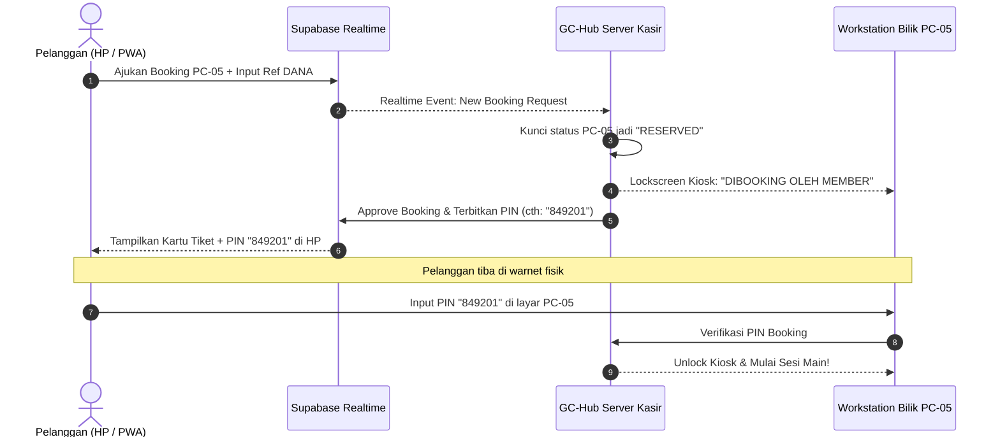
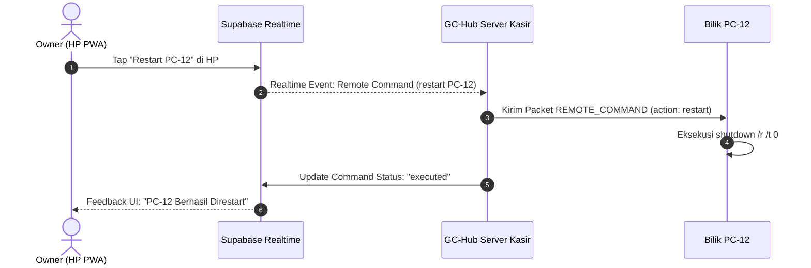

# 🌐 GC-HUB HYBRID CLOUD & PWA MOBILE ARCHITECTURE (2026 SPECIFICATION)
> **Authoritative Specification:** Solusi integrasi komprehensif antara GC-Hub Desktop Server (On-Premises Local SQLite & WebSocket) dengan Cloud Realtime (Supabase Postgres) dan Mobile PWA (Vercel) untuk Member Booking & Owner Remote Management.

---

## 🏗️ 1. Arsitektur Hybrid: Local Authority vs Cloud Mirror

```
+---------------------------------------------------------------------------------------------------+
|                                  2026 HYBRID WARNET TOPOLOGY                                      |
+---------------------------------------------------------------------------------------------------+

   📱 MOBILE USERS & OWNER (ANYWHERE / 4G / 5G / WI-FI)
   +-------------------------------------------------------------------+
   |  PWA Mobile Web App (Hosted on Vercel)                            |
   |  - Member: Cek PC Kosong, Booking Bilik, Upload DANA, Cek Saldo    |
   |  - Owner: Live Omset, Remote Control PC, 1-Tap Approval Antrean   |
   +-------------------------------------------------------------------+
                                    │  ▲
                     HTTPS / WSS   │  │ Supabase Realtime Channel
                                    ▼  │
   ☁️ CLOUD DATA & AUTH LAYER (SUPABASE)
   +-------------------------------------------------------------------+
   |  Supabase (Managed PostgreSQL + Row Level Security + Realtime)   |
   |  - Tables: profiles, workstations_live, bookings, topup_requests, |
   |            remote_commands, mobile_orders                         |
   |  - Realtime Publication: instant change broadcast                 |
   +-------------------------------------------------------------------+
                                    ▲  │
       Outbound HTTPS / Realtime    │  │ Push Sync / Command Stream
       (Zero Open Port / No Tunnel) │  ▼
   🖥️ WARNET LOCAL SERVER (ON-PREMISES KASIR)
   +-------------------------------------------------------------------+
   |  GC-Hub Electron Desktop Server                                   |
   |  - SupabaseSyncService (Background cloud mirror & bridge)         |
   |  - BillingEngine (Authoritative 1s tick & balance deduction)      |
   |  - Local SQLite (25 core tables - master authoritative journal)   |
   |  - Local WebSocket Server (Port 6894 replacement)                 |
   +-------------------------------------------------------------------+
                                    ▲
                         Gigabit LAN│ (Bidirectional Binary Protocol)
                                    ▼
   🖥️ WARNET CLIENT WORKSTATIONS (BILIK PC-01 s/d PC-50)
   +-------------------------------------------------------------------+
   |  GC-Hub Client Kiosk & Floating Widget Runtime                    |
   |  - Fullscreen Lock / Booking PIN Unlock / Desktop Guard           |
   +-------------------------------------------------------------------+
```

---

## 🔒 2. Keamanan & Keunggulan Arsitektur Ini
1. **Zero Open Port & No Tunnel Needed**:
   - PC Server kasir di warnet **TIDAK** perlu membuka port router (Port Forwarding), tidak butuh IP Publik Statis, dan tidak perlu menjalankan command line tunnel yang rentan.
   - Koneksi PC Server ke Supabase bersifat *Outbound HTTPS/WSS*, sehingga kebal dari serangan hacker internet luar.
2. **Local Offline Autonomy (Warnet Tetap Jalan 100% saat Internet Mati)**:
   - Jika internet ISP (Indihome/Biznet) terputus, warnet **TIDAK AKAN DOWN**. Billing local, kunci layar, order F&B, dan kasir tetap beroperasi normal via LAN lokal.
   - Saat internet kembali menyala, `SupabaseSyncService` otomatis melakukan *reconnect & backfill sync*.
3. **Tanpa Biaya Admin MDR (DANA Manual + 1-Tap Approval)**:
   - Member transfer ke nomor DANA kasir/owner.
   - Member input nomor referensi / upload screenshot di PWA.
   - Kasir/Owner mendapat notifikasi instan di layar PC & HP, tekan tombol **"Terima" (1-Tap)** $\rightarrow$ saldo atau kode PIN booking langsung terbit secara realtime.

---

## 🗄️ 3. Skema Database Supabase Cloud (Mirror Model)

### A. Tabel `workstations_live`
| Kolom | Tipe | Deskripsi |
|---|---|---|
| `id` | `TEXT PRIMARY KEY` | Identifier bilik (contoh: `PC-01`) |
| `name` | `TEXT` | Nama bilik (`Bilik 01 - VIP RTX 4060`) |
| `state` | `TEXT` | Status (`idle`, `active_member`, `active_guest`, `locked`, `offline`) |
| `user_label` | `TEXT` | Nama member atau label pengguna |
| `time_remaining_minutes` | `INT` | Sisa durasi (menit) |
| `time_used_minutes` | `INT` | Durasi terpakai (menit) |
| `active_app` | `TEXT` | Game / aplikasi aktif |
| `ip_address` | `TEXT` | IP lokal (hanya terlihat oleh Staff/Owner) |
| `updated_at` | `TIMESTAMPTZ` | Timestamp update terakhir |

### B. Tabel `bookings`
| Kolom | Tipe | Deskripsi |
|---|---|---|
| `id` | `UUID PRIMARY KEY` | ID booking unik |
| `workstation_id` | `TEXT` | Bilik yang dipesan |
| `member_id` | `UUID` | ID akun member |
| `member_name` | `TEXT` | Nama member |
| `booking_pin` | `TEXT` | 6-digit PIN untuk unlock bilik |
| `package_name` | `TEXT` | Paket billing yang dipilih |
| `duration_minutes` | `INT` | Durasi sewa |
| `total_price` | `NUMERIC` | Nominal pembayaran DANA |
| `payment_proof_url` | `TEXT` | URL screenshot bukti transfer |
| `payment_ref` | `TEXT` | Nomor referensi transaksi DANA |
| `status` | `TEXT` | `pending`, `approved`, `rejected`, `completed`, `cancelled` |
| `created_at` | `TIMESTAMPTZ` | Waktu pengajuan |

### C. Tabel `topup_requests`
| Kolom | Tipe | Deskripsi |
|---|---|---|
| `id` | `UUID PRIMARY KEY` | ID topup unik |
| `member_id` | `UUID` | ID akun member |
| `member_username`| `TEXT` | Username member |
| `amount` | `NUMERIC` | Nominal saldo yang dibeli |
| `payment_ref` | `TEXT` | Nomor referensi DANA |
| `proof_url` | `TEXT` | Bukti transfer DANA |
| `status` | `TEXT` | `pending`, `approved`, `rejected` |
| `processed_by` | `TEXT` | Nama kasir/owner yang menyetujui |
| `created_at` | `TIMESTAMPTZ` | Waktu request |

### D. Tabel `remote_commands`
| Kolom | Tipe | Deskripsi |
|---|---|---|
| `id` | `UUID PRIMARY KEY` | ID command |
| `workstation_id` | `TEXT` | Target PC (`PC-01` s/d `PC-50` atau `ALL`) |
| `command` | `TEXT` | `lock`, `unlock`, `restart`, `shutdown`, `wake_on_lan`, `broadcast_chat` |
| `payload` | `JSONB` | Data tambahan (contoh: teks pesan chat) |
| `status` | `TEXT` | `pending`, `executed`, `failed` |
| `created_by` | `TEXT` | Operator / Owner pengirim |
| `created_at` | `TIMESTAMPTZ` | Waktu dikirim |

---

## ⚡ 4. Alur Kerja (Workflows)

### Alur 1: Booking Bilik dari HP & Unlock Kiosk di Warnet


### Alur 2: Remote Kontrol Kasir/Owner dari HP

